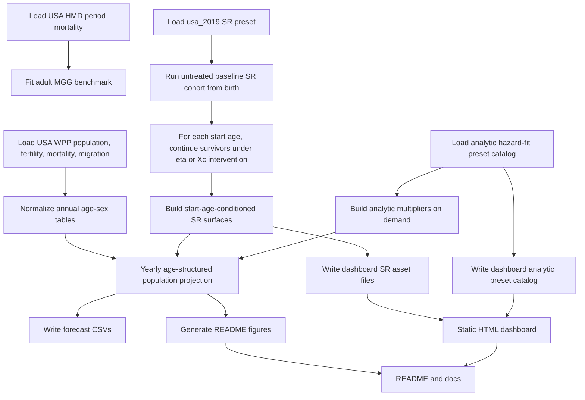

# Pipeline Walkthrough

This file explains the corrected USA validation pipeline step by step. The focus is on what each stage does, why it exists, and what modeling choice it introduces.

## End-to-end flow

## 1. USA demography from WPP

What goes in:
- yearly USA population by age and sex
- yearly mortality by age and sex
- yearly fertility by maternal age
- yearly sex ratio at birth
- yearly migration residual

What comes out:
- one clean yearly age-by-sex input bundle

Why this stage exists:
- the projection needs a demographic backbone before any intervention logic is added

What approximation it introduces:
- this pass keeps future demography exogenous and fixed to the WPP medium variant

## 2. Adult untreated benchmark from HMD and MGG

What goes in:
- USA adult period mortality from HMD

What comes out:
- a fitted MGG benchmark curve

Why this stage exists:
- it gives a sanity check against observed adult mortality before we start projecting intervention scenarios

What approximation it introduces:
- MGG is used as an adult benchmark layer, not as the intervention engine

## 3. Untreated SR baseline

What goes in:
- the `usa_2019` SR preset
- optional `Xc` heterogeneity for the sensitivity branch

What comes out:
- one untreated SR cohort simulation from birth
- saved survivor states by age

Why this stage exists:
- the corrected intervention model needs the actual state distribution of survivors at each possible treatment start age

What approximation it introduces:
- the USA validation pass uses one fixed USA baseline preset instead of refitting SR here

## 4. Start-age-conditioned intervention surfaces

What goes in:
- untreated survivor states at age `a_start`
- target parameter (`eta` or `Xc`)
- factor grid

What comes out:
- one hazard-multiplier row for every treatment start age

Why this stage exists:
- treatment does not affect everyone the same way
- someone who starts at 60 should not use the same SR trajectory as someone treated from birth

What approximation it introduces:
- the `sr` branch reads precomputed surfaces from disk
- the `analytic_arm` branch rebuilds the same surface shape directly from the fitted hazard formula

## 5. Leslie-equivalent projection state

What goes in:
- yearly WPP demography
- one scenario definition
- one intervention asset

What comes out:
- yearly population counts by sex and age

Why this stage exists:
- this is where the intervention is combined with births, survival, aging, and migration

What approximation it introduces:
- the code uses explicit vector and tensor updates instead of materializing one giant dense Leslie matrix, but the transition is Leslie-equivalent

## 6. Dashboard assets and docs

What goes in:
- processed demography
- calibration diagnostics
- one analytic preset catalog
- SR intervention surfaces split into deterministic per-asset files
- validation scenario catalog

What comes out:
- a static dashboard asset bundle
- figures and docs

Why this stage exists:
- this validation pass is meant to be inspected visually, not just executed from code
