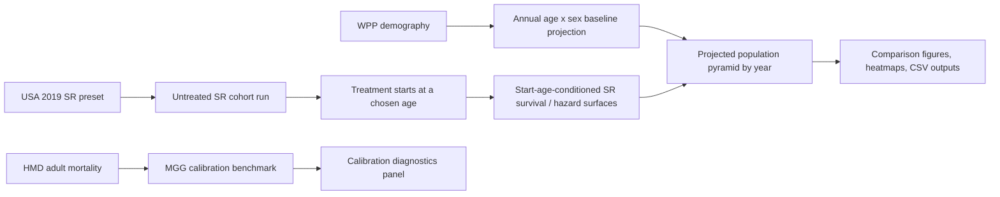

# Results Tutorial

This document is a guided tour of the outputs in the USA longevity dashboard build. It is not a UI manual. The goal here is to explain what is already in the results, what each figure is telling you, and how to interpret differences across intervention scenarios.

The key question behind the current build is:

> If a longevity intervention changes an SR parameter, and different age groups start treatment under different uptake rules, how does the USA population age structure change over time?

This pass is still a USA-only validation build. It is meant to help you inspect the mechanics before scaling to additional countries.

## What This Build Contains

The current result bundle combines four layers:

1. `UN WPP 2024` population projection data as the demographic backbone.
2. `HMD 2019` mortality as the historical adult benchmark.
3. `MGG` as an adult hazard fit diagnostic.
4. `SR` start-age-conditioned intervention surfaces for the treatment effect.

That means the projected population pyramids are demographic forecasts with an SR-derived intervention overlay, not raw SR simulations by themselves.

## How To Read The Main Outputs

There are five main result types in this build:

1. Population pyramids.
2. Total population trajectories.
3. Old-age share trajectories.
4. Treated-share heatmaps.
5. SR cohort survival curves.

Each one answers a different question.

### 1. Population pyramids

These show the full age distribution at a selected year. In the dashboard:

- left side of the pyramid is male
- right side is female
- lighter bars are total population
- darker overlay bars are treated population

This is the most direct answer to the project’s main question: what does the age distribution look like after the intervention starts?

### 2. Total population trajectories

These answer: does the intervention mainly reshuffle the age structure, or does it materially change total headcount too?

### 3. Old-age share trajectories

These answer: how much more top-heavy does the population become?

The current summary tables track both:

- share age `60+`
- share age `65+`

The plotted figures mostly emphasize the `65+` share because it is easier to interpret as an “older-population burden” indicator.

### 4. Treated-share heatmap

This is the bridge between scenario definition and demographic output. It shows which ages are treated in which years.

This panel is often the fastest way to understand why two scenarios with the same SR effect size produce different pyramids.

### 5. SR cohort survival curves

This panel is a mechanistic SR view. It shows how a cohort’s survival changes under the chosen intervention assumptions.

Important caveat:

- this panel is best interpreted comparatively
- it is not the same thing as the demographic baseline life table
- the projected population uses WPP demography as the population backbone

So this panel is most useful for comparing intervention patterns against each other, not for reading off literal US all-cause survival levels.

## First: The Untreated Baseline

The untreated baseline scenario is `no_one`. Nobody takes the intervention.

This is the reference case for all comparisons.

Selected summary values from [forecast_summary.csv](../outputs/forecast_summary.csv):

| Scenario | Year | Total population | Treated share | Share age 65+ | Median age |
|---|---:|---:|---:|---:|---:|
| `no_one` | 2025 | 347.3M | 0.0% | 18.4% | 39 |
| `no_one` | 2050 | 380.8M | 0.0% | 23.1% | 42 |
| `no_one` | 2075 | 402.9M | 0.0% | 26.7% | 44 |
| `no_one` | 2100 | 421.3M | 0.0% | 28.4% | 46 |

So even without any intervention, the USA baseline in this model already ages substantially over the century. That matters because the intervention is being layered on top of an already-aging population.

### Baseline pyramid evolution

What to notice:

- the base of the pyramid does not explode; this is not a high-fertility future
- the middle and upper ages widen steadily
- by the late decades, the structure looks more rectangular and top-heavy than the near-term baseline

That is the untreated reference shape. Every intervention figure should be interpreted as a deformation of this baseline.

## Threshold Intervention Example: Everyone 60+ Starts

The cleanest “main effect” scenario in the current build is:

- preset: `threshold_age_60_all_eligible`
- target: `eta`
- factor: `0.80x`

This means:

- treatment launches in 2025
- anyone who is 60 or older at launch starts immediately
- future cohorts start once they cross age 60
- after treatment start, `eta` grows more slowly rather than dropping discontinuously

Selected summary values:

| Scenario | Year | Total population | Treated share | Share age 65+ | Median age |
|---|---:|---:|---:|---:|---:|
| `no_one` | 2075 | 402.9M | 0.0% | 26.7% | 44 |
| `threshold_age_60_all_eligible_eta_0.80x` | 2075 | 420.3M | 33.4% | 29.7% | 46 |
| `threshold_age_60_all_eligible_eta_0.70x` | 2075 | 430.0M | 34.8% | 31.3% | 47 |

Interpretation:

- the intervention raises total population relative to baseline
- the population also becomes meaningfully older
- stronger `eta` reduction produces both more survivors and a more top-heavy age structure

### Baseline vs age-60 threshold intervention

What to look for:

- the intervention thickens the upper-age bars much more than the younger ages
- the lower pyramid remains similar because fertility is not being changed in this pass
- the visual signature is “top expansion,” not whole-pyramid scaling

This is exactly the kind of output you want if the question is: “What does a longevity drug do to the future age structure?”

## Effect Size Sweep: How Much Does Eta Matter?

The dashboard includes an `eta` factor grid from `1.00x` down to `0.70x`.

In this build:

- `1.00x` means no SR intervention effect
- lower values mean stronger slowing of the post-treatment `eta` slope

### Same uptake rule, different eta factors

This comparison is useful because it holds the start mechanism fixed and only changes intervention strength.

What to notice:

- the change is gradual, not all-or-nothing
- each stronger reduction in `eta` pushes more mass into old age
- the effect accumulates over time because the intervention acts on surviving cohorts year after year

The companion line views make the same point in a more aggregate way:

These figures are useful for two kinds of questions:

- “Does the intervention mostly add people, or mostly make the age distribution older?”
- “How nonlinear is the response as the SR effect gets stronger?”

From the current runs, the answer is: it does both. Total population rises, but the stronger visual effect is the increasing concentration at older ages.

## Uptake Rules Matter Even With The Same Biology

One of the main reasons this dashboard exists is to separate:

- biological effect size
- treatment start mechanism

The same `eta` shift can produce different age distributions depending on how people enter treatment.

### Comparison at eta = 0.80x

The main comparison scenarios are:

- `prescription_bands_absolute_eta_0.80x`
- `prescription_bands_equal_probabilities_eta_0.80x`
- `prescription_bands_uniform_start_age_eta_0.80x`
- `threshold_age_60_all_eligible_eta_0.80x`

Selected 2075 summary values:

| Scenario | Total population | Treated share | Share age 65+ | Median age |
|---|---:|---:|---:|---:|
| `no_one` | 402.9M | 0.0% | 26.7% | 44 |
| `threshold_age_60_all_eligible_eta_0.80x` | 420.3M | 33.4% | 29.7% | 46 |
| `prescription_bands_absolute_eta_0.80x` | 424.1M | 51.8% | 30.2% | 47 |
| `prescription_bands_equal_probabilities_eta_0.80x` | 413.1M | 37.8% | 28.4% | 45 |
| `prescription_bands_uniform_start_age_eta_0.80x` | 412.3M | 35.9% | 28.3% | 45 |

This is one of the most important result sets in the build.

Interpretation:

- `absolute` produces the strongest demographic effect among the banded rules
- `equal_probabilities` and `uniform_start_age` are milder because treatment is spread later across the age bands
- changing only the start mechanism can shift both treated share and total 65+ burden materially

In plain terms: if the drug reaches the same eventual fraction of people but reaches them later, the long-run pyramid can look quite different.

### Old-age share under different start rules

This figure is especially useful if your main interest is population aging rather than total population size. It makes the timing effect much clearer than the pyramids alone.

## Paper-Style Coverage Scenarios

The build also includes the more paper-like intervention presets:

- `no_one`
- `only_elderly_65plus`
- `50pct_elderly_65plus`
- `30pct_middle_40_64_plus_70pct_elderly_65plus`
- `half_population_adult_band`
- `everyone`

### Paper-style comparison

This figure is good for intuition. It asks:

- what if only elderly people get the drug?
- what if coverage is mixed across middle age and elderly groups?
- what if almost everyone gets it?

A particularly useful anchor is the `everyone_eta_0.80x` run.

Selected values:

| Scenario | Year | Total population | Treated share | Share age 65+ | Median age |
|---|---:|---:|---:|---:|---:|
| `everyone_eta_0.80x` | 2050 | 391.6M | 91.5% | 24.9% | 43 |
| `everyone_eta_0.80x` | 2075 | 434.8M | 85.4% | 31.5% | 48 |
| `everyone_eta_0.80x` | 2100 | 481.3M | 81.1% | 36.9% | 52 |

This is close to an upper-bound scenario in the current setup. It shows how strongly the population can shift upward in age if treatment is both broad and effective.

## Treated Share Heatmap

This is one of the easiest panels to underestimate.

What it tells you:

- where the intervention is concentrated by age
- how quickly treatment coverage spreads through the population over time
- whether a scenario reaches older people only, or gradually propagates through adult cohorts more broadly

How to use it:

- if two pyramid scenarios look different, check the heatmap first
- if one scenario has much stronger upper-age expansion, you will usually see earlier or broader coverage in the heatmap

This is the panel that best connects “intervention policy” to “demographic consequence.”

## Heterogeneity Sensitivity

The build also includes a heterogeneity branch:

- baseline preset: `usa_2019`
- heterogeneity option: `usa_2019 + Xc Gaussian heterogeneity`

### Heterogeneity comparison

How to interpret it:

- this is not a different policy scenario
- it is a different assumption about baseline SR heterogeneity
- use it as a sensitivity check, not as a main headline result

This panel answers:

- are the projected intervention effects fragile to reasonable heterogeneity in `Xc`?
- or do the main scenario conclusions survive that perturbation?

## SR Cohort View

This figure is the most mechanistic one in the set.

What it shows:

- survival of a cohort under different intervention coverage schemes
- treated from the SR side, not directly from the demographic projection side

How to read it correctly:

- compare curves against each other
- do not over-interpret the absolute untreated level as the final demographic baseline

This figure is best for confirming directional logic:

- broader intervention coverage shifts the survival curve outward
- stronger or earlier treatment keeps more of the cohort alive to later ages

## Calibration Diagnostic: HMD vs MGG

This is not an intervention result. It is a diagnostics panel.

It compares:

- `HMD`: the observed historical USA mortality rates used as adult targets
- `MGG`: the fitted Gamma-Gompertz-Makeham curve used as an adult benchmark

Why it matters:

- it tells you whether the adult hazard backbone is sane
- it gives confidence that the demographic benchmark is not drifting arbitrarily away from historical mortality

Why it is not the main story:

- it is a model-fit check
- it does not directly tell you what the intervention does

If you are reading the dashboard results as an end user, treat this panel as a “trust but verify” plot.

## What The Most Important Comparisons Mean

If you only have time to inspect a few outputs, these are the highest-value comparisons.

### A. `no_one` vs `threshold_age_60_all_eligible_eta_0.80x`

Use this to answer:

- what happens if the drug is real, works moderately well, and starts at a clean retirement-age threshold?

This is the clearest baseline intervention comparison.

### B. `threshold_age_60_all_eligible_eta_0.80x` vs `threshold_age_60_all_eligible_eta_0.70x`

Use this to answer:

- how sensitive are the population outcomes to effect size?

This is the clearest biological-dose comparison.

### C. `prescription_bands_absolute_eta_0.80x` vs `prescription_bands_equal_probabilities_eta_0.80x`

Use this to answer:

- if eventual coverage is similar but starts are spread differently over age, how much does timing matter?

This is the clearest uptake-rule comparison.

### D. `threshold_age_60_all_eligible_eta_0.80x` vs `everyone_eta_0.80x`

Use this to answer:

- how far are the threshold policy scenarios from an aggressive upper-bound rollout?

This is the clearest policy-scale comparison.

## A Good Way To Explore The Dashboard

If you want to use the results interactively rather than just read them:

1. Start with `no_one` as the comparison baseline.
2. Set the active scenario to `threshold_age_60_all_eligible`.
3. Sweep `eta` from `1.00x` down to `0.70x`.
4. Watch the pyramid year at `2050`, `2075`, and `2100`.
5. Then switch to the three banded uptake rules at `eta = 0.80x`.
6. Use the heatmap to understand why the pyramids differ.

That sequence usually makes the structure of the model clear very quickly.

## Important Caveats

There are several caveats to keep in mind while reading the figures.

### 1. USA only

This is still a USA validation build.

### 2. Medium-variant demography backbone

The current validated pass is centered on the `medium` demographic backbone.

### 3. SR cohort curves are comparative

The SR cohort survival panel is most useful for relative comparison across intervention cases. It should not be treated as the final authoritative all-cause USA survival curve.

### 4. Fertility is not intervention-responsive here

In this pass, the drug changes mortality dynamics only. It does not endogenously change fertility.

### 5. This stage is about mechanics

The point of this build is to validate:

- start-age-conditioned SR treatment logic
- uptake-rule differences
- demographic consequences of those differences

It is not yet the final multi-country policy engine.

## Where The Main Files Are

- Dashboard: [dashboard/index.html](../dashboard/index.html)
- Scenario summary table: [forecast_summary.csv](../outputs/forecast_summary.csv)
- Full population-by-year export: [forecast_population.csv](../outputs/forecast_population.csv)
- Main README: [README.md](../README.md)
- Pipeline walkthrough: [pipeline.md](./pipeline.md)
- Dashboard guide: [dashboard.md](./dashboard.md)
- Validation scenario list: [usa_validation.md](./usa_validation.md)

## Bottom Line

The most important takeaway from the current results is simple:

- the biological effect size matters
- the age at which treatment starts matters
- the rule that governs treatment start matters

Even with the same intervention target and the same nominal SR effect, different uptake/start schemes produce different treated cohort structures, different old-age shares, and different future pyramids.

That is exactly the reason to keep the SR effect surface and the uptake mechanism separate in the model.
